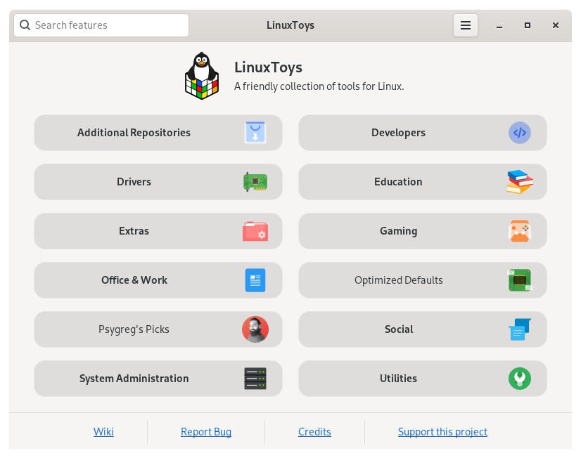

# LinuxToys

[LinuxToys](https://linux.toys) is a collection of user-friendly tools designed for Linux systems. It aims to make powerful Linux functionality accessible to all users through an intuitive interface. For a complete feature list and detailed documentation, please visit our [Wiki](https://linux.toys/knowledgebase.html).

## For those on GitHub
This is a mirror of the [official repository](https://git.linux.toys/psygreg/linuxtoys) in which this project is active. If you wish to contribute, consider heading there instead to be credited in the contributors. Your stars here are very welcome in any case!

<picture>
  <source media="(prefers-color-scheme: dark)" srcset="src/dark-lt.png">
  
</picture>

## Compatibility

LinuxToys is compatible with the following Linux distributions, provided they are running their latest stable versions:

*   **Debian** and derivatives (Ubuntu, Linux Mint, etc.)
*   **Fedora** and derivatives (RHEL, CentOS, AlmaLinux, etc.)
*   **Arch Linux** and derivatives (Manjaro, EndeavourOS, etc.)
*   **OpenSUSE** (Leap and Tumbleweed)
*   **Atomic Distributions** (Atomic Fedora, Universal Blue images like Bazzite, Bluefin, Aurora)

## Installation

### Automatic Installation

The simplest way to install LinuxToys is by using the automated installation script. Open your terminal and run:

```bash
curl -fsSL https://linux.toys/install.sh | bash
```

### Manual Installation

If you prefer to review the script before running it, you can download and execute it manually:

```bash
curl -fsSLJO https://linux.toys/install.sh
chmod +x install.sh
./install.sh
```

### Official Repositories

LinuxToys is available in several official and community repositories for easier package management.

#### Ubuntu (PPA)

You can install LinuxToys from our official PPA on [Launchpad](https://launchpad.net/~psygreg/+archive/ubuntu/linuxtoys):

```bash
sudo add-apt-repository ppa:psygreg/linuxtoys
sudo apt update
sudo apt install linuxtoys
```

#### Fedora / RHEL / OpenSUSE (COPR)

Packages are available via [Fedora COPR](https://copr.fedorainfracloud.org/coprs/psygreg/linuxtoys/) for AlmaLinux 10, Fedora 41/42, OpenSUSE Leap/Tumbleweed, and RHEL 9/10.

**For Standard Systems:**

```bash
sudo dnf copr enable psygreg/linuxtoys
sudo dnf install linuxtoys
```

**For Atomic Systems (Fedora Atomic, Universal Blue):**

```bash
curl -fsSL https://copr.fedorainfracloud.org/coprs/psygreg/linuxtoys/repo/fedora-$(rpm -E %fedora)/psygreg-linuxtoys-fedora-$(rpm -E %fedora).repo | sudo tee /etc/yum.repos.d/psygreg-linuxtoys-fedora-$(rpm -E %fedora).repo
sudo rpm-ostree install linuxtoys
```

#### Arch Linux (AUR)

Arch Linux users can install the `linuxtoys-bin` package from the [AUR](https://aur.archlinux.org/packages/linuxtoys-bin):

```bash
git clone https://aur.archlinux.org/linuxtoys-bin.git
cd linuxtoys-bin
makepkg -si
```

## From source [GIT](https://github.com/psygreg/linuxtoys/)

> [!WARNING]
> This version is under constant development, therefore it may have instability as well as new features not yet available in the stable versions.

Running the application from source, please follow these steps.

### Prerequisites

Ensure your system has the necessary dependencies installed.

**Debian/Ubuntu:**
```bash
sudo apt install -y bash git curl wget zenity python3 python3-gi python3-requests libgtk-3-0 gir1.2-gtk-3.0 gir1.2-vte-2.91
```

**Fedora/RHEL:**
```bash
sudo dnf install -y bash git curl wget zenity python3 python3-gobject python3-requests gtk3 vte291
```

**Arch Linux:**
```bash
sudo pacman -S --noconfirm bash git curl wget zenity python python-gobject python-requests gtk3 vte3
```

**OpenSUSE:**
```bash
sudo zypper in -y bash git curl wget zenity python3 python3-gobject python3-requests gtk3 libvte-2_91-0 typelib-1_0-Vte-2.91
```

### Cloning and Running

**Clone the repository:**
```bash
git clone --depth=1 https://github.com/psygreg/linuxtoys.git
cd linuxtoys
```

**Run the application:**
```bash
p3/run.py
```

**Update the application:**
> [!NOTE]
> When choosing the GIT method, updates must be made via GIT.

```bash
git pull
```

## Development

For developers who wish to contribute, check our documentation, please refer to the [Developer Guide](dev/README.md).

## Contributing

We welcome contributions! If you are interested in helping improve LinuxToys, please review our [Contribution Guidelines](CONTRIBUTING.md).

## Credits

This project is made possible by the community. For a full list of contributors, please visit our [Credits Page](https://linux.toys/credits.html).
