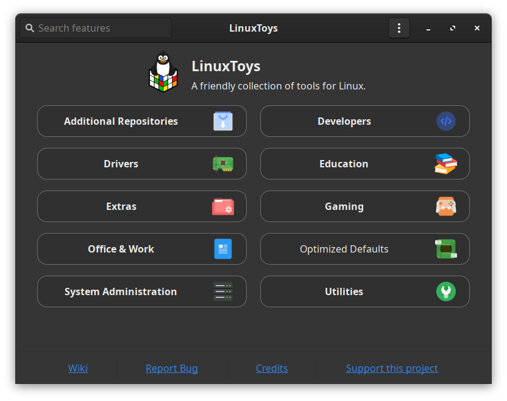

# LinuxToys
A collection of tools for Linux in a user-friendly way to make your life on Linux easier than ever.

## For you

A multitool that just works, with a comfortable, practical and simple graphical interface that looks good and gets the job done. It also follows the theme of your system!

### [Get it here!](https://github.com/psygreg/linuxtoys/releases)

## For professionals

With the CLI mode, taking a long time to set up computers for your customers will be a thing of the past. Just list all features you need installed in the manifest file, and let LinuxToys do the job for you. You can save your custom manifest file to use it to standardize your customers' systems. And don't worry: it won't apply resources that are not meant for the target!

## For developers

The ultimate platform for bash script development allowing for quick deployment of fixes for common issues on Linux, and much more, powered by our libraries. Don't believe it? Take a look at our [Developer Handbook](https://github.com/psygreg/linuxtoys/wiki/Developer-Handbook) and see it for yourself!

## [Learn more at the Wiki!](https://github.com/psygreg/linuxtoys/wiki)
